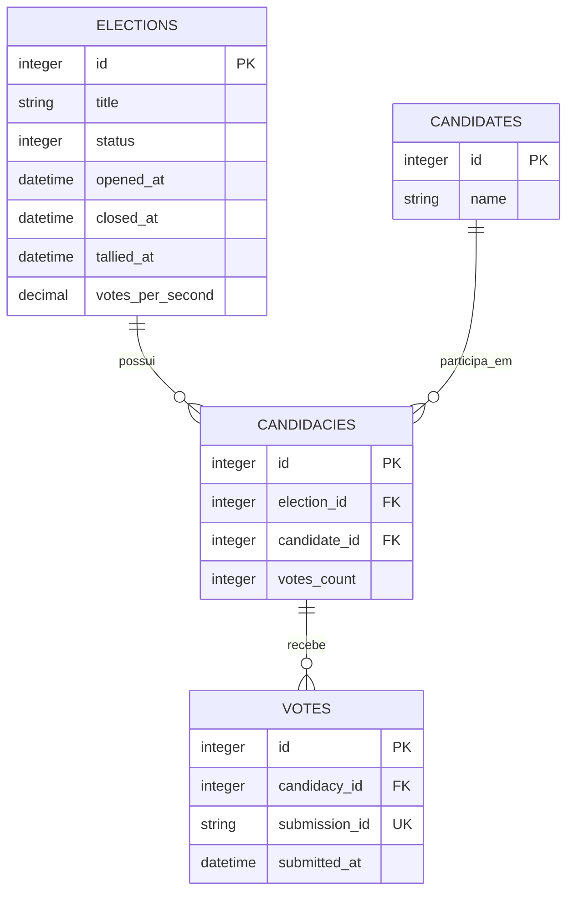

# Plataforma de votação

Aplicação Rails para votações anônimas entre candidatos. Uma eleição reúne
candidaturas, e cada candidatura associa um candidato do catálogo global a uma
eleição.

## Rodando com Docker

Com o Docker instalado, execute na raiz do projeto:

```sh
docker compose up --build
```

O comando inicia a aplicação, o processador de votos, Redis, Prometheus e
Grafana. Depois que os serviços estiverem prontos,
acesse:

- Aplicação: [http://localhost:3000](http://localhost:3000)
- Dashboard do Sidekiq: [http://localhost:3000/sidekiq](http://localhost:3000/sidekiq)
- Prometheus: [http://localhost:9090](http://localhost:9090)
- Grafana: [http://localhost:3001](http://localhost:3001)

Para apagar todos os dados, resetar o banco e carregar novamente os dados
iniciais:

```sh
docker compose run --rm -e DISABLE_DATABASE_ENVIRONMENT_CHECK=1 web bin/rails db:reset
```

## Testes e integração contínua

Os testes unitários e de integração usam Minitest. Como parte deles depende do
Redis para validar a fila Sidekiq, execute-os pelo Docker Compose, que inicia o
serviço necessário:

```sh
docker compose run --rm -e RAILS_ENV=test web bin/rails db:test:prepare test
```

Para executar apenas um arquivo de teste, informe seu caminho ao Rails:

```sh
docker compose run --rm -e RAILS_ENV=test web bin/rails db:test:prepare test/models/vote_test.rb
```

O workflow de CI em [`.github/workflows/ci.yml`](.github/workflows/ci.yml) é
executado em todo pull request e em cada push para `master`. Ele verifica
vulnerabilidades Ruby, JavaScript e dependências, executa o RuboCop, os testes
unitários e de integração, e os testes de sistema. Quando um teste de sistema
falha, as capturas de tela são disponibilizadas como artefato da execução.

## Arquitetura

É uma aplicação Rails 8.1 com SQLite para os dados da aplicação e Redis para a
fila de trabalhos assíncronos do Sidekiq.

```text
Navegador
  → Rails / VotesController
  → Redis / fila votes
  → Sidekiq / RegisterVoteJob
  → SQLite / Vote
```

O controller de votos apenas recebe a requisição e enfileira o trabalho. O
`RegisterVoteJob` localiza a eleição e a candidatura, aplica as regras do
domínio e grava o voto. Assim, a resposta HTTP não espera pela persistência e
o aviso de sucesso confirma o envio para a fila.

## Domínio

- `Election`: uma votação, com os estados `pending`, `open` e `closed`.
- `Candidate`: candidato reutilizável em diferentes eleições.
- `Candidacy`: associa um candidato a uma eleição; a combinação é única por
  eleição.
- `Vote`: voto anônimo em uma candidatura. Não armazena dados de identificação
  do votante.

### Diagrama ER



Uma eleição aberta registra `opened_at`; ao encerrar, registra `closed_at`. O
job só aceita votos submetidos dentro dessa janela.

## Arquitetura da contagem de votos

`Vote` é a fonte de verdade. `Candidacy#votes_count` é uma projeção de leitura
reconstruível, usada para consultar os resultados sem agrupar todos os votos a
cada leitura. `Election#tallied_at` informa quando essa projeção foi atualizada
pela última vez, e `Election#votes_per_second` armazena a média de votos por
segundo da apuração.

Para manter o processamento idempotente no Sidekiq, o job usa seu ID como
`submission_id` único: se uma submissão for reprocessada, o mesmo voto não é
persistido duas vezes.

```text
Vote
  → Sidekiq Cron (a cada 5 segundos)
  → RefreshElectionResultsJob
  → GROUP BY candidacy_id
  → Candidacy#votes_count, Election#tallied_at e Election#votes_per_second
```

A cada 5 segundos, o job atualiza o resultado das eleições abertas ou encerradas recentemente
(últimos cinco minutos). A fila `results` tem prioridade sobre `votes` para que
a atualização não fique aguardando uma carga contínua de votos.

> **Atenção:** os resultados exibidos podem apresentar até 5 segundos de
> atraso em relação aos votos processados.

A apuração é provisória: um voto submetido antes do encerramento pode ainda
estar na fila quando a primeira contagem ocorre. A janela de cinco minutos
permite que a projeção convirja à medida que esses votos válidos são gravados.
`votes_per_second` considera os votos persistidos e seus horários de
`submitted_at`.

## Componentes em execução

- Puma atende as requisições Rails.
- Sidekiq processa as filas `results` e `votes`.
- Redis armazena as filas do Sidekiq.
- SQLite armazena eleições, candidatos, candidaturas e votos.

No desenvolvimento, `bin/dev` inicia os processos `web`, `css` e `jobs`.

## API JSON

Os endpoints abaixo são públicos e respondem JSON quando a requisição usa
`Accept: application/json` ou a extensão `.json`.

### Listar eleições

`GET /elections`

Retorna as eleições em ordem de ID, com os dados necessários para identificá-las:

```sh
curl -H 'Accept: application/json' http://localhost:3000/elections
```

```json
{
  "elections": [
    { "id": 1, "title": "Eleição do conselho", "status": "open" },
    { "id": 2, "title": "Eleição do grêmio", "status": "closed" }
  ]
}
```

### Consultar uma eleição

`GET /elections/:id`

Retorna o estado da eleição e as candidaturas disponíveis, em ordem de ID:

```sh
curl -H 'Accept: application/json' http://localhost:3000/elections/1
```

```json
{
  "status": "open",
  "candidacies": [
    { "id": 12, "candidate_name": "Maria da Silva" },
    { "id": 15, "candidate_name": "João Oliveira" }
  ]
}
```

`status` pode ser `pending`, `open` ou `closed`. O endpoint retorna `404` se a
eleição não existir.

### Consultar resultados

`GET /elections/:id/results`

Retorna a última projeção de apuração, ordenada pela quantidade de votos e,
em caso de empate, pelo ID da candidatura. `tallied_at` indica quando a
projeção foi atualizada pela última vez e pode ser `null` antes da primeira
apuração.

```sh
curl -H 'Accept: application/json' http://localhost:3000/elections/1/results
```

```json
{
  "election": {
    "id": 1,
    "title": "Eleição do conselho",
    "status": "open",
    "tallied_at": "2026-08-06T17:30:00.000Z",
    "votes_per_second": 1.25
  },
  "total_votes": 4,
  "candidacies": [
    {
      "id": 12,
      "candidate_name": "Maria da Silva",
      "votes_count": 3,
      "percentage": 75.0
    },
    {
      "id": 15,
      "candidate_name": "João Oliveira",
      "votes_count": 1,
      "percentage": 25.0
    }
  ]
}
```

`votes_count` e `percentage` são derivados da última apuração disponível; a
submissão de um voto aceita pela API pode ainda não estar refletida nela.

### Enviar um voto

`POST /elections/:election_id/votes`

Envie o ID da candidatura no corpo JSON:

```sh
curl -X POST http://localhost:3000/elections/1/votes \
  -H 'Accept: application/json' \
  -H 'Content-Type: application/json' \
  -d '{"vote":{"candidacy_id":12}}'
```

Uma submissão aceita retorna `202 Accepted`:

```json
{
  "message": "Voto registrado com sucesso."
}
```

A resposta confirma apenas o enfileiramento. A validação da eleição e da
candidatura, assim como a persistência, ocorre no `RegisterVoteJob`.

## Teste de carga

O cenário [load_tests/votes.js](load_tests/votes.js), executado com [k6](https://k6.io/), simula
requisições reais de voto: consulta a eleição como JSON para obter as candidaturas
e envia `POST` para `/elections/:id/votes`. Ele não chama o Sidekiq diretamente.

Por segurança, o envio de votos é limitado a cinco requisições por minuto para cada IP. Para
evitar `429 Too Many Requests` e aumentar a capacidade do Puma durante o teste
de carga, inicie a aplicação com Docker e use o override dedicado:

```sh
docker compose -f compose.yml -f compose.load-test.yml up --build
```

Enquanto esse modo estiver ativo, o limite de votos fica desativado para todos
os clientes.
`RAILS_MAX_THREADS` define as threads por worker e `WEB_CONCURRENCY` define a
quantidade de workers. Nessa configuração de override do Docker, o Puma pode atender até 128 requisições
simultâneas (16 × 8).

Para rodar o teste de carga, execute:

```sh
k6 run \
  -e BASE_URL=http://localhost:3000 \
  -e ELECTION_ID=5 \
  -e RATE=1000 \
  -e DURATION=30 \
  -e CONCURRENCY=1000 \
  load_tests/votes.js
```

- `RATE`: votos por segundo desejados; o padrão é `1000`.
- `DURATION`: duração do teste em segundos; o padrão é `10`.
- `CONCURRENCY`: máximo de VUs (requisições simultâneas); o padrão é `50`.
- `ELECTION_ID`: eleição aberta a receber os votos; obrigatório.
- `BASE_URL`: endereço da aplicação; o padrão é `http://localhost:3000`.
