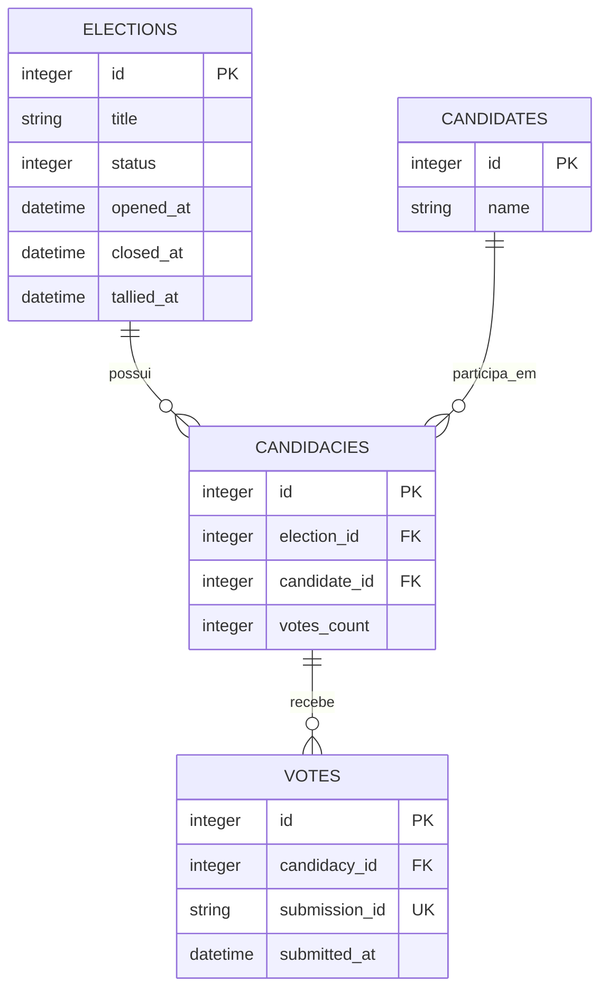

# Plataforma de votação

Aplicação Rails para votações anônimas entre candidatos. Uma eleição reúne
candidaturas; cada candidatura associa um candidato do catálogo global a uma
eleição.

## Arquitetura

É um monólito Rails 8.1 com SQLite para os dados da aplicação e Redis para a
fila de trabalhos assíncronos.

```text
Navegador
  → Rails / VotesController
  → Redis / fila votes
  → Sidekiq / RegisterVoteJob
  → SQLite / Vote
```

O controller de votos apenas recebe a requisição e enfileira o trabalho. O
`RegisterVoteJob` localiza a eleição e a candidatura, aplica as regras do
domínio e grava o voto. Assim, a resposta HTTP não espera pela persistência e
o aviso de sucesso confirma o envio para a fila.

## Domínio

- `Election`: uma votação, com os estados `pending`, `open` e `closed`.
- `Candidate`: candidato reutilizável em diferentes eleições.
- `Candidacy`: associa um candidato a uma eleição; a combinação é única por
  eleição.
- `Vote`: voto anônimo em uma candidatura. Não armazena dados de identificação
  do votante.

### Diagrama ER



Uma eleição aberta registra `opened_at`; ao encerrar, registra `closed_at`. O
job só aceita votos submetidos dentro dessa janela e usa o ID do job para evitar
duplicar uma submissão reprocessada.

## Arquitetura da contagem de votos

`Vote` é a fonte de verdade. `Candidacy#votes_count` é uma projeção de leitura
reconstruível, usada para consultar os resultados sem agrupar todos os votos a
cada leitura. `Election#tallied_at` informa quando essa projeção foi atualizada
pela última vez.

```text
Vote
  → Sidekiq Cron (a cada 10 segundos)
  → RefreshElectionResultsJob
  → GROUP BY candidacy_id
  → Candidacy#votes_count e Election#tallied_at
```

A cada 10 segundos, o job atualiza eleições abertas ou encerradas recentemente
(últimos cinco minutos). A fila `results` tem prioridade sobre `votes` para que
a atualização não fique aguardando uma carga contínua de votos.

A apuração é provisória: um voto submetido antes do encerramento pode ainda
estar na fila quando a primeira contagem ocorre. A janela de cinco minutos
permite que a projeção convirja à medida que esses votos válidos são gravados.

## Componentes em execução

- Puma atende as requisições Rails.
- Sidekiq processa as filas `results`, `votes` e `default`, nessa ordem.
- Redis armazena as filas do Sidekiq.
- SQLite armazena eleições, candidatos, candidaturas e votos.
- O dashboard do Sidekiq está disponível em `/sidekiq`.

No desenvolvimento, `bin/dev` inicia os processos `web`, `css` e `jobs`.

## Teste de carga

O cenário [load_tests/votes.js](load_tests/votes.js), executado com [k6](https://k6.io/), simula
requisições reais de voto: obtém o token CSRF e os candidatos da página da
eleição e envia `POST` para `/elections/:id/votes`. Ele não chama o Sidekiq
diretamente.

O Puma inicia com apenas três threads por padrão. Para que um teste com muitas
conexões simultâneas não fique limitado pelo servidor antes de medir o fluxo de
votação, aumente as threads e os workers do Puma ao iniciar o `bin/dev`:

```sh
RAILS_MAX_THREADS=16 WEB_CONCURRENCY=8 mise exec -- bin/dev
```

`RAILS_MAX_THREADS` define as threads por worker e `WEB_CONCURRENCY` define a
quantidade de workers. Nesse exemplo, o Puma pode atender até 128 requisições
simultâneas (16 × 8).

Para rodar o teste de carga execute:

```sh
k6 run \
  -e BASE_URL=http://localhost:3000 \
  -e ELECTION_ID=1 \
  -e RATE=1000 \
  -e DURATION=30 \
  -e CONCURRENCY=100 \
  load_tests/votes.js
```

- `RATE`: votos por segundo desejados; o padrão é `1000`.
- `DURATION`: duração do teste em segundos; o padrão é `10`.
- `CONCURRENCY`: máximo de VUs (requisições simultâneas); o padrão é `50`.
- `ELECTION_ID`: eleição aberta a receber os votos; obrigatório.
- `BASE_URL`: endereço da aplicação; o padrão é `http://localhost:3000`.

Mais threads não tornam a persistência no SQLite paralela; elas aumentam a
capacidade de receber e enfileirar votos. Para medir a capacidade do servidor,
prefira executar o k6 em outra máquina, para que ele não dispute recursos com
Rails e Redis.
