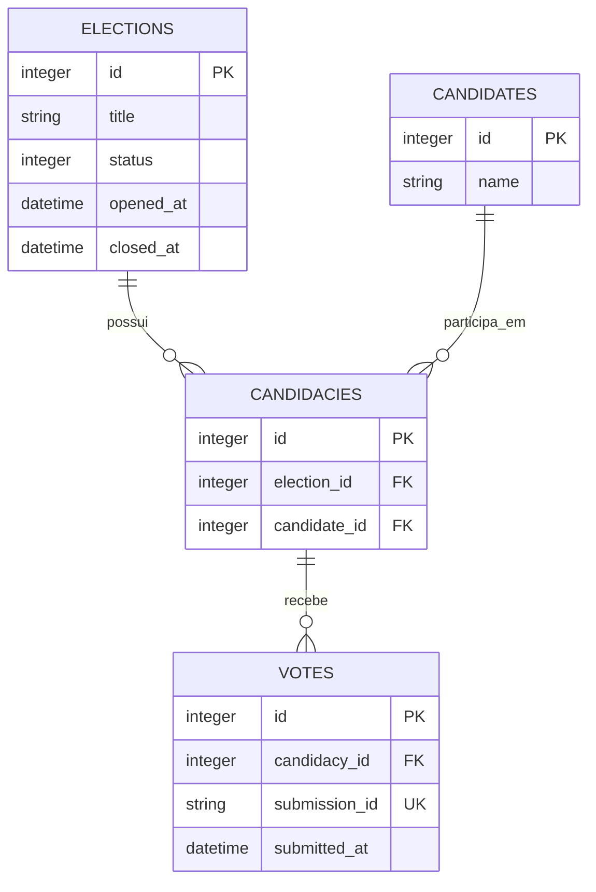

# Plataforma de votação

Aplicação Rails para votações anônimas entre candidatos. Uma eleição reúne
candidaturas; cada candidatura associa um candidato do catálogo global a uma
eleição.

## Arquitetura

É um monólito Rails 8.1 com SQLite para os dados da aplicação e Redis para a
fila de trabalhos assíncronos.

```text
Navegador
  → Rails / VotesController
  → Redis / fila votes
  → Sidekiq / RegisterVoteJob
  → SQLite / Vote
```

O controller de votos apenas recebe a requisição e enfileira o trabalho. O
`RegisterVoteJob` localiza a eleição e a candidatura, aplica as regras do
domínio e grava o voto. Assim, a resposta HTTP não espera pela persistência e
o aviso de sucesso confirma o envio para a fila.

## Domínio

- `Election`: uma votação, com os estados `pending`, `open` e `closed`.
- `Candidate`: candidato reutilizável em diferentes eleições.
- `Candidacy`: associa um candidato a uma eleição; a combinação é única por
  eleição.
- `Vote`: voto anônimo em uma candidatura. Não armazena dados de identificação
  do votante.

### Diagrama ER



Uma eleição aberta registra `opened_at`; ao encerrar, registra `closed_at`. O
job só aceita votos submetidos dentro dessa janela e usa o ID do job para evitar
duplicar uma submissão reprocessada.

## Componentes em execução

- Puma atende as requisições Rails.
- Sidekiq processa as filas `votes` e `default`, nessa ordem.
- Redis armazena as filas do Sidekiq.
- SQLite armazena eleições, candidatos, candidaturas e votos.
- O dashboard do Sidekiq está disponível em `/sidekiq`.

No desenvolvimento, `bin/dev` inicia os processos `web`, `css` e `jobs`.

## Teste de carga

O script [`bin/load_votes`](bin/load_votes) simula requisições reais de voto:
obtém o token CSRF da página da eleição e envia `POST` para
`/elections/:id/votes`. Ele não chama o Sidekiq diretamente.

O Puma inicia com apenas três threads por padrão. Para que um teste com muitas
conexões simultâneas não fique limitado pelo servidor antes de medir o fluxo de
votação, aumente as threads e os workers do Puma ao iniciar o `bin/dev`:

```sh
RAILS_MAX_THREADS=16 WEB_CONCURRENCY=8 mise exec -- bin/dev
```

`RAILS_MAX_THREADS` define as threads por worker e `WEB_CONCURRENCY` define a
quantidade de workers. Nesse exemplo, o Puma pode atender até 128 requisições
simultâneas (16 × 8), próximo das 100 conexões usadas no teste de carga abaixo.

Para rodar o teste de carga execute:

```sh
RATE=1000 DURATION=30 CONCURRENCY=100 mise exec -- bin/load_votes
```

- `RATE`: votos por segundo desejados; o padrão é `1000`.
- `DURATION`: duração do teste em segundos; o padrão é `10`.
- `CONCURRENCY`: número de conexões HTTP concorrentes; o padrão é `50`.
- `ELECTION_ID`: eleição aberta específica; sem ela, o script usa a primeira
  eleição aberta.
- `BASE_URL`: endereço da aplicação; o padrão é `http://localhost:3000`.

Mais threads não tornam a persistência no SQLite paralela, elas aumentam a capacidade de receber e enfileirar votos.
