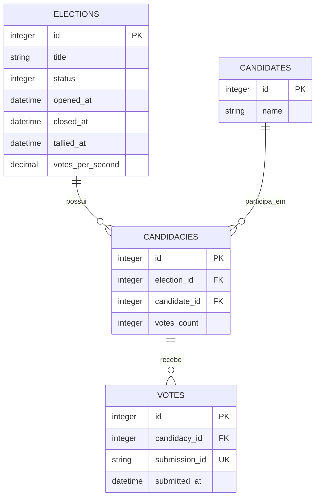

# Plataforma de votação

Aplicação Rails para votações anônimas entre candidatos. Uma eleição reúne
candidaturas; cada candidatura associa um candidato do catálogo global a uma
eleição.

## Rodando com Docker

O arquivo `config/master.key` não é versionado por segurança. Se
`RAILS_MASTER_KEY` não for informada, o contêiner cria uma chave local na
primeira execução e a guarda no volume Docker. Ela é reutilizada nas próximas
execuções; nenhum arquivo de chave é criado no repositório. Nesse modo, as
credenciais criptografadas compartilhadas não são usadas. Para usá-las, forneça
a chave original em `RAILS_MASTER_KEY`.

Com o Docker instalado, execute na raiz do projeto:

```sh
docker compose up --build
```

Abra [http://localhost:3000](http://localhost:3000). O comando inicia a
aplicação, o processador de votos e o Redis, sem precisar instalar Ruby.

Para apagar todos os dados, resetar o banco e carregar novamente os dados
iniciais:

```sh
docker compose run --rm -e DISABLE_DATABASE_ENVIRONMENT_CHECK=1 web bin/rails db:reset
```

## Arquitetura

É um monólito Rails 8.1 com SQLite para os dados da aplicação e Redis para a
fila de trabalhos assíncronos.

```text
Navegador
  → Rails / VotesController
  → Redis / fila votes
  → Sidekiq / RegisterVoteJob
  → SQLite / Vote
```

O controller de votos apenas recebe a requisição e enfileira o trabalho. O
`RegisterVoteJob` localiza a eleição e a candidatura, aplica as regras do
domínio e grava o voto. Assim, a resposta HTTP não espera pela persistência e
o aviso de sucesso confirma o envio para a fila.

## Domínio

- `Election`: uma votação, com os estados `pending`, `open` e `closed`.
- `Candidate`: candidato reutilizável em diferentes eleições.
- `Candidacy`: associa um candidato a uma eleição; a combinação é única por
  eleição.
- `Vote`: voto anônimo em uma candidatura. Não armazena dados de identificação
  do votante.

### Diagrama ER



Uma eleição aberta registra `opened_at`; ao encerrar, registra `closed_at`. O
job só aceita votos submetidos dentro dessa janela e usa o ID do job para evitar
duplicar uma submissão reprocessada.

## Arquitetura da contagem de votos

`Vote` é a fonte de verdade. `Candidacy#votes_count` é uma projeção de leitura
reconstruível, usada para consultar os resultados sem agrupar todos os votos a
cada leitura. `Election#tallied_at` informa quando essa projeção foi atualizada
pela última vez, e `Election#votes_per_second` armazena a média de votos por
segundo da apuração.

```text
Vote
  → Sidekiq Cron (a cada 10 segundos)
  → RefreshElectionResultsJob
  → GROUP BY candidacy_id
  → Candidacy#votes_count, Election#tallied_at e Election#votes_per_second
```

A cada 10 segundos, o job atualiza eleições abertas ou encerradas recentemente
(últimos cinco minutos). A fila `results` tem prioridade sobre `votes` para que
a atualização não fique aguardando uma carga contínua de votos.

A apuração é provisória: um voto submetido antes do encerramento pode ainda
estar na fila quando a primeira contagem ocorre. A janela de cinco minutos
permite que a projeção convirja à medida que esses votos válidos são gravados.
`votes_per_second` considera os votos persistidos e seus horários de
`submitted_at`: divide o total pelo intervalo entre a primeira e a última
submissão, usando uma janela mínima de um segundo.

## Componentes em execução

- Puma atende as requisições Rails.
- Sidekiq processa as filas `results`, `votes` e `default`, nessa ordem.
- Redis armazena as filas do Sidekiq.
- SQLite armazena eleições, candidatos, candidaturas e votos.
- O dashboard do Sidekiq está disponível em `/sidekiq`.

No desenvolvimento, `bin/dev` inicia os processos `web`, `css` e `jobs`.

## Monitoramento local

Em ambientes locais, a aplicação expõe métricas Prometheus em
`http://localhost:3000/metrics`. Esse endpoint não é exposto em produção.
Ao iniciar o Puma com mais de um worker, a aplicação agrega as métricas dos
processos em `tmp/prometheus`; arquivos de processos já encerrados são
removidos na inicialização.

O processo `jobs` também inicia um exporter somente local em
`http://127.0.0.1:9394/metrics`. Ele expõe a profundidade, a latência, as taxas
de sucesso e falha e o tempo de execução das filas Sidekiq. Após alterar o
`Procfile.dev`, reinicie o `bin/dev` para aplicar essa configuração.

Instale o Prometheus e o Grafana com Homebrew:

```sh
brew install prometheus grafana
```

Copie a configuração versionada do Prometheus para a instalação local:

```sh
cp config/prometheus/prometheus.local.yml "$(brew --prefix)/etc/prometheus.yml"
```

Edite `$(brew --prefix)/etc/grafana/grafana.ini` e configure a porta do
Grafana para não conflitar com o Rails:

```ini
[server]
http_port = 3001
```

Com o Rails em execução na porta 3000, inicie os serviços:

```sh
brew services start prometheus
brew services start grafana
```

O Prometheus estará em [http://localhost:9090](http://localhost:9090) e o
Grafana em [http://localhost:3001](http://localhost:3001). Para provisionar
automaticamente o datasource Prometheus e o dashboard versionado, adicione ao
bloco `[paths]` de `$(brew --prefix)/etc/grafana/grafana.ini`:

```ini
provisioning = /Users/roberto/code/bbb/config/grafana/provisioning
```

Reinicie o Grafana após essa alteração. O dashboard **Rails - Endpoints**
mostra requisições por segundo, latência p95 por endpoint, respostas por faixa
de status e os endpoints mais lentos. Ele usa uma janela de taxa adaptativa,
adequada para visualizar testes curtos de carga. O dashboard **Sidekiq -
Filas** é provisionado no mesmo diretório e mostra a situação de cada fila.

## API JSON

Os endpoints abaixo são públicos e respondem JSON quando a requisição usa
`Accept: application/json` ou a extensão `.json`.

### Listar eleições

`GET /elections`

Retorna as eleições em ordem de ID, com os dados necessários para identificá-las:

```sh
curl -H 'Accept: application/json' http://localhost:3000/elections
```

```json
{
  "elections": [
    { "id": 1, "title": "Eleição do conselho", "status": "open" },
    { "id": 2, "title": "Eleição do grêmio", "status": "closed" }
  ]
}
```

### Consultar uma eleição

`GET /elections/:id`

Retorna o estado da eleição e as candidaturas disponíveis, em ordem de ID:

```sh
curl -H 'Accept: application/json' http://localhost:3000/elections/1
```

```json
{
  "status": "open",
  "candidacies": [
    { "id": 12, "candidate_name": "Maria da Silva" },
    { "id": 15, "candidate_name": "João Oliveira" }
  ]
}
```

`status` pode ser `pending`, `open` ou `closed`. O endpoint retorna `404` se a
eleição não existir.

### Consultar resultados

`GET /elections/:id/results`

Retorna a última projeção de apuração, ordenada pela quantidade de votos e,
em caso de empate, pelo ID da candidatura. `tallied_at` indica quando a
projeção foi atualizada pela última vez e pode ser `null` antes da primeira
apuração. `votes_per_second` é a média de votos persistidos por segundo desde a
primeira submissão registrada.

```sh
curl -H 'Accept: application/json' http://localhost:3000/elections/1/results
```

```json
{
  "election": {
    "id": 1,
    "title": "Eleição do conselho",
    "status": "open",
    "tallied_at": "2026-08-06T17:30:00.000Z",
    "votes_per_second": 1.25
  },
  "total_votes": 4,
  "candidacies": [
    {
      "id": 12,
      "candidate_name": "Maria da Silva",
      "votes_count": 3,
      "percentage": 75.0
    },
    {
      "id": 15,
      "candidate_name": "João Oliveira",
      "votes_count": 1,
      "percentage": 25.0
    }
  ]
}
```

`votes_count` e `percentage` são derivados da última apuração disponível; a
submissão de um voto aceita pela API ainda pode não estar refletida nela.

### Enviar um voto

`POST /elections/:election_id/votes`

Envie o ID da candidatura no corpo JSON. Não é necessário token CSRF ou cookie:

```sh
curl -X POST http://localhost:3000/elections/1/votes \
  -H 'Accept: application/json' \
  -H 'Content-Type: application/json' \
  -d '{"vote":{"candidacy_id":12}}'
```

Uma submissão aceita retorna `202 Accepted`:

```json
{
  "message": "Voto registrado com sucesso."
}
```

A resposta confirma apenas o enfileiramento. A validação da eleição e da
candidatura, assim como a persistência, ocorre no `RegisterVoteJob`.

## Teste de carga

O cenário [load_tests/votes.js](load_tests/votes.js), executado com [k6](https://k6.io/), simula
requisições reais de voto: consulta a eleição como JSON para obter as candidaturas
e envia `POST` para `/elections/:id/votes`. Ele não chama o Sidekiq diretamente.

O envio de votos é limitado a cinco requisições por minuto para cada IP. Para
evitar `429 Too Many Requests` e aumentar a capacidade do Puma durante o teste
de carga, inicie a aplicação com:

```sh
LOAD_TEST_MODE=true RAILS_MAX_THREADS=16 WEB_CONCURRENCY=8 bin/dev
```

Enquanto esse modo estiver ativo, o limite de votos fica desativado para todos
os clientes. Ao término do teste, reinicie a aplicação sem a variável (o padrão
é `false`) ou com `LOAD_TEST_MODE=false`.

`RAILS_MAX_THREADS` define as threads por worker e `WEB_CONCURRENCY` define a
quantidade de workers. Nesse exemplo, o Puma pode atender até 128 requisições
simultâneas (16 × 8).

Para rodar o teste de carga execute:

```sh
k6 run \
  -e BASE_URL=http://localhost:3000 \
  -e ELECTION_ID=1 \
  -e RATE=1000 \
  -e DURATION=30 \
  -e CONCURRENCY=100 \
  load_tests/votes.js
```

- `RATE`: votos por segundo desejados; o padrão é `1000`.
- `DURATION`: duração do teste em segundos; o padrão é `10`.
- `CONCURRENCY`: máximo de VUs (requisições simultâneas); o padrão é `50`.
- `ELECTION_ID`: eleição aberta a receber os votos; obrigatório.
- `BASE_URL`: endereço da aplicação; o padrão é `http://localhost:3000`.
